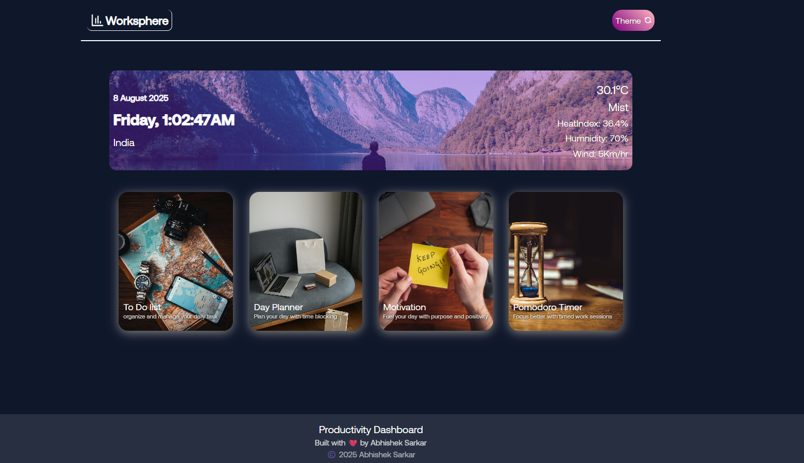

# 🚀 Productivity Dashboard

A feature-rich productivity dashboard ⚡️ with live weather 🌦️, real-time clock 🕒, to-do list ✅, planner 🗓️, motivational quotes 💡, and a Pomodoro timer 🍅—everything you need for a focused, organized day!

## Screenshots

## ✨ Features
- 🌗 Dark/Light theme toggle
- 🌦️ Live weather updates (API-based)
- 🕒 Real-time clock & date
- ✅ To-Do list & daily planner
- 💡 Motivational quotes
- 🍅 Pomodoro timer for focused work sessions
- ⚡️ Clean, fast, and responsive—built with pure JavaScript

## 🚀 Getting Started

1. Clone the repository  
git clone https://github.com/your-username/productivity-dashboard.git

2. Open `index.html` in your browser.

> ℹ️ For weather, add your API key in the JS file if needed.
